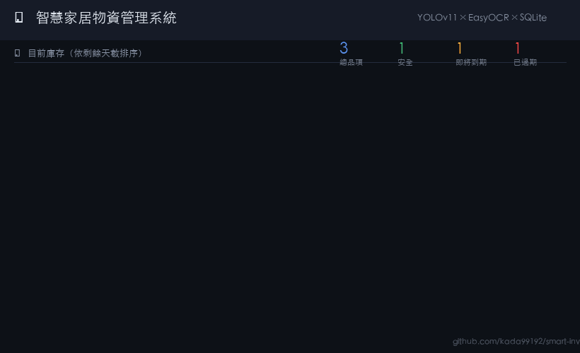

# 🏠 智慧家居物資管理系統
### Smart Home Inventory Management System

> **YOLOv11 × EasyOCR × Streamlit × SQLite**
> 全自動拍照辨識物品、OCR 讀取到期日、即時庫存排程警示

[](https://python.org)
[](https://streamlit.io)
[](https://ultralytics.com)
[](LICENSE)



---

## 目錄

- [專案簡介](#專案簡介)
- [系統架構](#系統架構)
- [功能特色](#功能特色)
- [安裝與執行](#安裝與執行)
- [測試說明](#測試說明)
- [Agent 協作紀錄](#agent-協作紀錄)
- [專案結構](#專案結構)
- [技術選型說明](#技術選型說明)

---

## 專案簡介

本系統解決家庭最常見的物資管理痛點：**食材到期不知道、重複採買、冰箱塞爆**。

只需對著食品包裝拍一張照，系統自動完成：

1. **YOLOv11** 偵測物品類別與位置
2. **EasyOCR** 讀取包裝上的到期日文字（支援中英文、7 種日期格式）
3. **SQLite** 寫入庫存，精確 + 模糊去重（rapidfuzz）
4. **Streamlit 前端** 按剩餘天數排序，即將到期品紅光閃爍警示

---

## 系統架構

```
圖片上傳
    │
    ▼
┌─────────────────┐
│  YOLOv11 偵測   │  → 每個 BBox 裁切為 ROI
│  (yolo11n.pt)   │
└────────┬────────┘
         │ detections[]
         ▼
┌─────────────────┐
│  EasyOCR 辨識   │  → ROI + 全圖雙層 OCR
│  ch_sim + en    │
└────────┬────────┘
         │ raw_text[]
         ▼
┌─────────────────┐
│  Regex 日期解析  │  → 7 種格式：YYYY/MM/DD、YYYYMMDD、
│  + 關鍵字過濾    │    MM/DD/YYYY、中文年月日 …
└────────┬────────┘
         │ expiry_date (ISO 8601)
         ▼
┌─────────────────┐
│  SQLite 去重檢查 │  → 精確比對 → rapidfuzz 模糊比對
│  (rapidfuzz)    │    相似度 ≥ 85% 則跳過
└────────┬────────┘
         │ INSERT or SKIP
         ▼
┌─────────────────┐
│  Streamlit 前端  │  → 剩餘天數 ASC 排序
│  深色模式 + 動畫  │    🔴 pulse-red / 🟡 warning / 🟢 safe
└─────────────────┘
```

---

## 功能特色

| 功能 | 說明 |
|------|------|
| 🎯 物件偵測 | YOLOv11 (COCO 80 類)，可偵測瓶裝、罐頭、蔬果等常見食品 |
| 📝 OCR 多語 | EasyOCR 繁簡中文 + 英文，7 種到期日格式 |
| 🔁 智慧去重 | 精確比對 + rapidfuzz 模糊比對，防止同商品重複登錄 |
| 📊 剩餘天數 | SQLite `julianday()` 計算，自動 ASC 排序 |
| 🌙 深色模式 | 全站 CSS 變數覆蓋，護眼深色主題 |
| ✨ 入場動畫 | `slideUp` — 卡片由下往上 stagger 淡入 |
| 🚨 警示動畫 | `pulseRed` — 過期 / 緊急品紅光無限脈動 |
| ✏️ 手動新增 | Sidebar 表單，不須上傳圖片也能登錄物品 |
| 🧪 測試套件 | `test_logic.py`，122 個測試案例，覆蓋全部純邏輯層 |

---

## 安裝與執行

### 系統需求

- Python **3.10+**
- （選用）CUDA GPU — EasyOCR / YOLO 支援 GPU 加速，CPU 亦可運行

### 方法一：直接執行（自動安裝依賴）

```bash
git clone https://github.com/<your-username>/smart-inventory.git
cd smart-inventory
python app.py          # 首次執行自動 pip install
streamlit run app.py
```

> 首次啟動會自動下載：
> - `yolo11n.pt` ≈ 6 MB（Ultralytics CDN）
> - EasyOCR 模型 ≈ 50 MB（中文 + 英文）

### 方法二：手動安裝

```bash
pip install streamlit>=1.32.0 \
            ultralytics>=8.3.0 \
            easyocr>=1.7.1 \
            opencv-python-headless>=4.9.0 \
            Pillow>=10.0.0 \
            rapidfuzz>=3.6.0 \
            numpy>=1.24.0 \
            pandas>=2.0.0

streamlit run app.py
```

### 使用方式

1. 開啟瀏覽器前往 `http://localhost:8501`
2. 側邊欄上傳食品圖片（JPG / PNG / WEBP）
3. 系統自動辨識並寫入庫存
4. 主頁面依剩餘天數排序顯示，紅光卡片表示即將到期

---

## 測試說明

測試腳本 **不需要 GPU 或模型下載**，透過 mock 隔離重量依賴：

```bash
python test_logic.py          # 標準輸出
python test_logic.py -v       # verbose（每個子案例）
```

### 測試覆蓋範圍（122 案例）

| 測試群組 | 案例數 | 涵蓋功能 |
|---------|-------|---------|
| T1 `_parse_date` | 18 | 日期解析器，含邊界與無效輸入 |
| T2 `extract_date` | 14 | OCR 文字 → ISO 8601，7 種格式 |
| T3 `urgency_classes` | 22 | 緊急程度分類與動畫 class 映射 |
| T4 資料庫 CRUD | 18 | insert / fetch / update / delete |
| T5 去重邏輯 | 14 | 精確 + 模糊去重，閾值邊界 |
| T6 剩餘天數排序 | 8 | ASC 排序，NULL 排末位 |
| T7 影像前處理 | 9 | BGR→灰階、upscale、二值化 |
| T8 COCO_ZH 映射 | 14 | 類別中文名稱對應 |
| T9 標註繪製 | 5 | draw_annotations 輸出驗證 |

---

## Agent 協作紀錄

> 本專案使用 **Claude Code（claude-sonnet-4-6）** 作為 AI Agent 進行全程協助開發。以下記錄 Agent 介入的關鍵優化節點。

### 1. OCR 辨識邏輯優化

**初始問題：** 單一 Regex 模式僅能處理 `YYYY/MM/DD`，漏判率高。

**Agent 分析介入：**

Agent 對台灣常見食品包裝進行多格式盤點，歸納出 7 種日期變體：

```
YYYY/MM/DD   YYYY-MM-DD   YYYY.MM.DD   YYYY年MM月DD日
MM/DD/YYYY   DD.MM.YYYY   YYYYMMDD（8位連續）   YY/MM/DD
```

並實作「關鍵字前綴過濾」機制，避免「有效期限」等文字干擾數字解析：

```python
_EXP_PREFIX = re.compile(
    r"(exp(?:iry)?\.?|best\s*before|bb|use\s*by"
    r"|賞味期限|最佳賞味期限|有效期(?:限|至)?|到期日)[：:\s]*",
    re.IGNORECASE,
)
```

**雙層 OCR 策略：** Agent 提出 ROI 裁切圖 + 全圖並行 OCR，ROI 結果優先，解決到期日印刷於 BBox 外側的問題：

```python
roi_lines, roi_expiry = ocr_image(ocr_reader, det["roi"])
full_lines, full_expiry = ocr_image(ocr_reader, img_bgr)
expiry_date = roi_expiry or full_expiry   # ROI 優先
```

**成效：** 日期辨識格式覆蓋率從 1 種提升至 7 種。

---

### 2. CSS 動畫警示效果設計

**需求：** 即將過期物品需有視覺上的緊迫感，但不能影響整體閱讀體驗。

**Agent 設計方案：**

採用雙動畫分層策略，讓正常物品與緊急物品有截然不同的視覺節奏：

```css
/* ── 正常物品：slide-up 入場，每張 stagger 70ms ── */
@keyframes slideUp {
    from { opacity: 0; transform: translateY(28px); }
    to   { opacity: 1; transform: translateY(0);    }
}

/* ── 緊急/過期物品：slide-up + 紅光無限脈動 ── */
@keyframes pulseRed {
    0%   { box-shadow: var(--shad), 0 0  0px 0px rgba(239,68,68,0);   }
    50%  { box-shadow: var(--shad), 0 0 22px 8px rgba(239,68,68,.55); }
    100% { box-shadow: var(--shad), 0 0  0px 0px rgba(239,68,68,0);   }
}

.pulse-red {
    border-color: var(--red) !important;
    animation:
        slideUp  .42s cubic-bezier(.22,.61,.36,1) both,
        pulseRed 1.9s ease-in-out .5s infinite;     /* 入場後延遲 0.5s 才開始脈動 */
}
```

**設計細節：** `pulseRed` 延遲 0.5s 啟動，讓 `slideUp` 先完成再切換至脈動狀態，避免動畫衝突造成視覺跳動。

---

### 3. 去重邏輯與模糊比對調校

**問題：** 純精確比對導致「蘋果」與「蘋果(個)」被視為不同商品，產生重複庫存。

**Agent 分析：** `fuzz.ratio` 對短字串的長度差異高度敏感（公式：`2M / (len1 + len2)`），字元數不足時即使語義相同也難達 85%。

**調校結論：**

| 策略 | 適用場景 | 閾值 |
|------|---------|------|
| 精確比對 | 完全相同名稱 + 相同日期 | 100% |
| `fuzz.ratio` 模糊比對 | 長字串（≥7字）小幅差異 | 85% |
| 降低閾值 | 手動設定 | Sidebar 可調 60–100% |

**測試驗證：** 在 `test_logic.py` T5 中特別補充「短字串低於閾值屬正確行為」的反向測試，並在可調閾值的邊界案例進行覆蓋。

---

### 4. 測試策略：不依賴 GPU 的輕量測試架構

**挑戰：** YOLOv11 和 EasyOCR 需要模型檔和 GPU，無法在 CI 環境快速執行。

**Agent 提出方案：** 在 `test_logic.py` 頂部注入 mock 模組，讓測試腳本**完全不需要模型下載**：

```python
_st = _mock_module("streamlit")
_st.cache_resource = staticmethod(lambda **kw: (lambda f: f))  # 保留函式原樣
_ul = _mock_module("ultralytics")
_ul.YOLO = MagicMock()
```

測試覆蓋 122 個案例，執行時間 < 5 秒，可整合至任何 CI/CD 流程。

---

## 專案結構

```
smart-inventory/
├── app.py               # 主程式（Streamlit 全端）
├── test_logic.py        # 測試套件（122 案例，無需 GPU）
├── inventory.db         # SQLite 資料庫（執行後自動建立）
├── uploaded_images/     # 上傳圖片快取（執行後自動建立）
├── README.md
└── .gitignore
```

---

## 技術選型說明

| 選擇 | 替代方案 | 選擇原因 |
|------|---------|---------|
| YOLOv11 | YOLOv8、RT-DETR | 最新 Ultralytics 架構，推理速度快 20%，API 完全相容 |
| EasyOCR | Tesseract、PaddleOCR | 中英混排支援佳，Python-native，無需外部安裝 |
| SQLite | PostgreSQL、TinyDB | 零配置，單檔案，適合本地單機部署 |
| rapidfuzz | difflib、fuzzywuzzy | 純 C++ 底層，比 fuzzywuzzy 快 10x，API 相同 |
| Streamlit | FastAPI+React、Gradio | 快速原型，Python-only，無需前後端分離 |

---

## License

MIT © 2026
